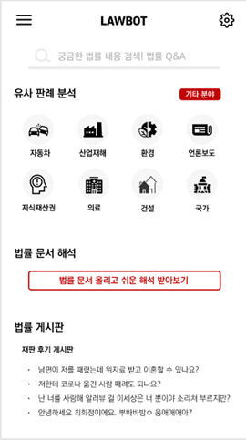
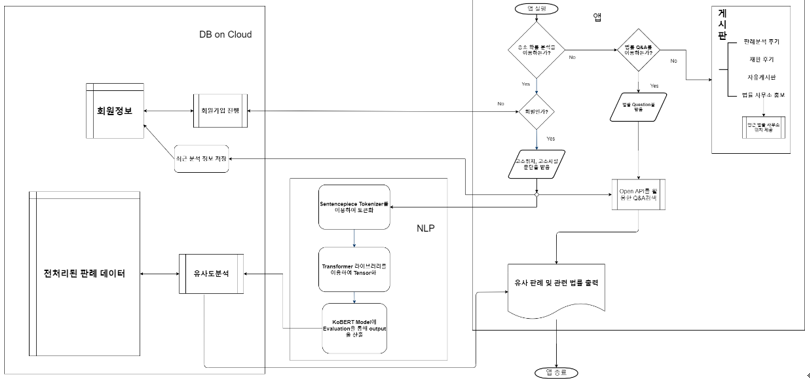

#  Lawbot 

### 자연어처리 및 비전을 이용한 AI 기반 맞춤형 법률 서비스 앱 개발 

### 2020 ict 한이음 공모전 동상 수상

---

## 📣 소개

- **Lawbot**은 법률로 부터 소외될 수 있는 계층을 위해 만들어진 자연어처리를 이용한 AI 기반 맞춤형 법률 서비스입니다.
- 소장 입력시 네이버 ocr api를 통하여 키워드를 뽑아낸 후 nlp모델을 통해 분석 후 관련 판례 제공.
- 네이버 검색 api와 국가에서 제공하는 법령 api를 통하여 법률 용어와 관련 법령 검색 서비스 제공
- 변호사 인증을 통해 인증된 변호사와 Qna 서비스 제공
- 마이페이지 기능을 통해 판례 다시보기 및 원하는 나의 변호사 기능 지원
- 비슷한 사람들과의 소통을 위한 커뮤니티 기능 지원

## Demo

[Youtube video link](https://youtu.be/iHc02hxnq-M)

## App

[apk file](https://drive.google.com/file/d/1mdvdv0vexwYidwanG-KKhPva_8KTmlZZ/view?usp=sharing) (currently service not available, just as a legacy)

## Final Report 

[pdf link](https://github.com/lylajeon/Lawbot/blob/frontendMobile/final_report.pdf) or [viewer link](https://www.hanium.or.kr/html/skin/doc.html?fn=20200915101010510.hwp&rs=/html/synap)

---

더 자세한 내용은 다음을 참고하세요.

## 로그인과 회원가입

| 로그인                      | 회원가입                      |
| --------------------------- | ----------------------------- |
|  |  |

본인 인증 시스템은 AWS의 SNS 서비스를 활용하였으나 현재는 AWS계정이 중지된 상태

## 소장 입력시 유사판례 제공

|  |  |
| --------------------------------------------------------- | ------------------------------------------------------------ |

사용자가 본인의 상황 양식을 소장에 청구취지와 청구원인을 채우거나 이미지 파일을 통해 소장 등을 제시하면 네이버 ocr api를 통해 청구취지와 청구원인을 도출한다. 그 후, 자연어처리 기술(TF-IDF)을 통해 유사한 판례를 찾는데 필요한 키워드만을 뽑아 판례 DB에서 이와 유사한 판례를 찾아 제시해주는 기능이다.

## 법률 용어와 법령 검색 서비스

판례, 고소장 등에서 잘 모르는 법률 용어가 나타나면, 앱 안에서 바로 검색하여 용어에 대한 뜻풀이를 얻을 수 있다.

## 전문 변호사 QNA

QnA 게시판을 통해 법률 전문가로부터 질문에 대한 전문적인 답변을 받을 수 있다.

## 커뮤니티 서비스

|  |  |
| ------------------------ | ------------------------ |

자유롭게 법률 정보 및 의견을 나눌 수 있는 커뮤니티를 조성하여 법에 대한 접근성을 제고하고 앱 활성화를 도모한다.

## 마이 페이지

마이페이지를 통해 자신이 쓴 글을 볼 수 있게 하였고, 즐겨찾기 스크랩 기능을 구현하여 자신이 스크랩한 글을 다시 볼 수 있도록 하였다. 

## 프로젝트 관리

## 기술 스택

App : React Native

Backend : Express, Mysql, Docker

## ERD 설계도

## S/W 구성도

## 서비스 흐름도 

